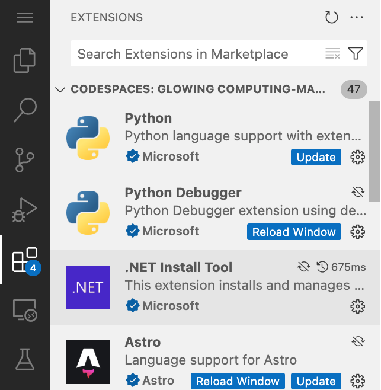

# Exercise 0: Prerequisites

Before we get started on the lab, there's a few tasks we need to complete to get everything ready. We need to get a copy of the repository which includes the code, then spin up a [codespace](https://github.com/features/codespaces) to create our code.

## Setting up the Lab Repository

To create a copy of the repository for the code you'll create an instance from the [template](https://docs.github.com/en/repositories/creating-and-managing-repositories/creating-a-template-repository). The new instance will contain all of the necessary files for the lab, and you'll use it as you work through the exercises. 

1. Navigate to the [GitHub repository for this lab](https://github.com/github-samples/agents-in-sdlc).
2. Create your own copy of the repository by selecting the **Use this template** button on the lab repository page. Then select **Create a new repository**.

    

3. For labs at Microsoft build, choose **Microsoft-Build-2025** as the GitHub organization. Set the repository name to **310-<YOUR_GITHUB_HANDLE>**, replacing **<YOUR_GITHUB_HANDLE>** with your GitHub handle. So if your handle was Mona, you'd use **310-Mona**.

    

4. Make a note of the repository path you created, which will be **Microsoft-Build-2025/310-<YOUR_GITHUB_HANDLE>**, as you will be referring to this later in the lab.

## Creating a codespace

Next up, we will be using a codespace to complete the lab exercises. [GitHub Codespaces](https://github.com/features/codespaces) are a cloud-based development environment that allows you to write, run, and debug code directly in your browser. It provides a fully-featured IDE with support for multiple programming languages, extensions, and tools.

1. Navigate to your newly created repository.
2. Select the green **Code** button.

    

3. Select the **Codespaces** tab and select the **+** button to create a new Codespace.

    

4. Wait for the codespace to be created. This may take a few minutes depending on the container image size, the number of extensions being installed and any post install scripts that are being run. Please be patient while the codespace is being created.

    

## Update and restart extensions

The setup process for the codespace will install and setup [VS Code extensions](https://code.visualstudio.com/docs/configure/extensions/extension-marketplace). As with any software, updates may be needed. When your codespace is created we'll need to ensure everything is up-to-date.

1. Select **Extensions** on the workbench on the left side of your codespace.

    

2. Select **Update** on any extensions with an **Update** button. Repeat as necessary.
3. Select **Reload Window** on any extensions with a **Reload Window** button to reload the codespace.
4. When prompted by a dialog, select **Reload** to reload the window. This will ensure the latest version is being used.

## Setup Complete

Congratulations, you have created a copy of the lab repository! Now, let's move on to the [next step](./1-mcp.md), utilizing Model Context Protocol (MCP) to provide GitHub Copilot Agent Mode access to a suite of tools.
