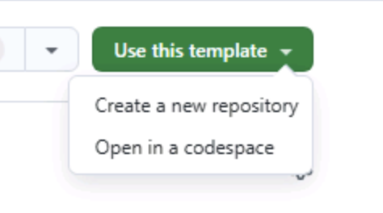
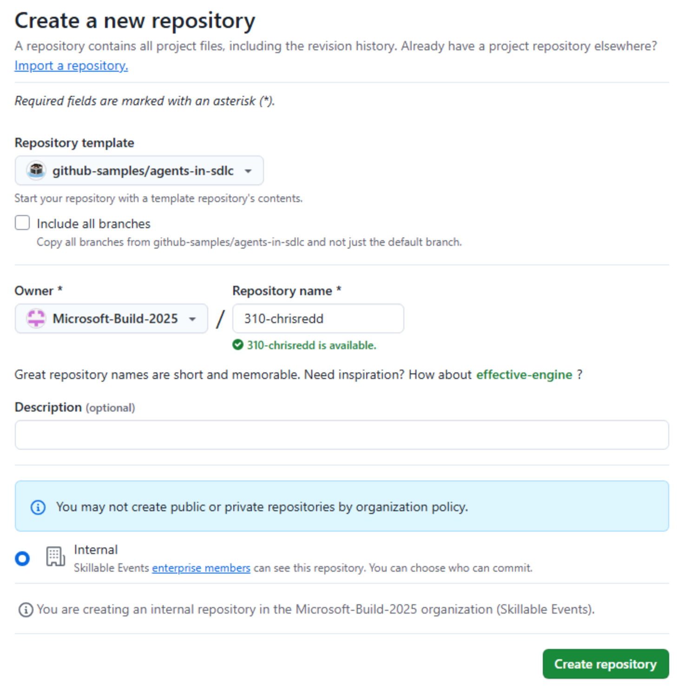
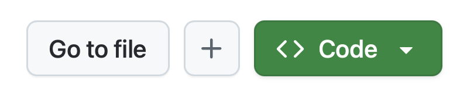
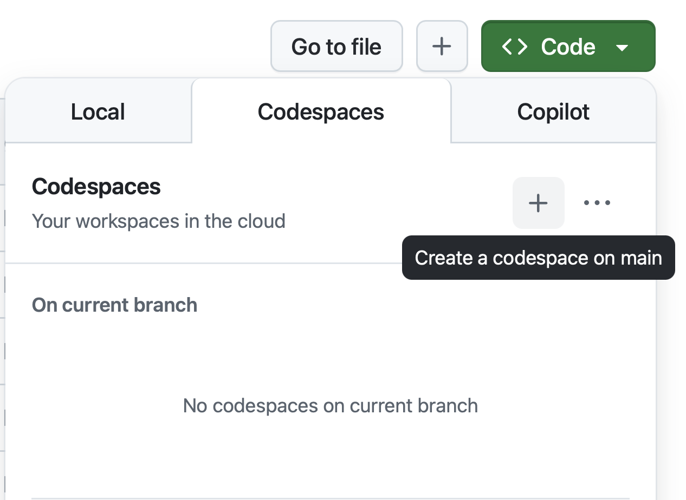
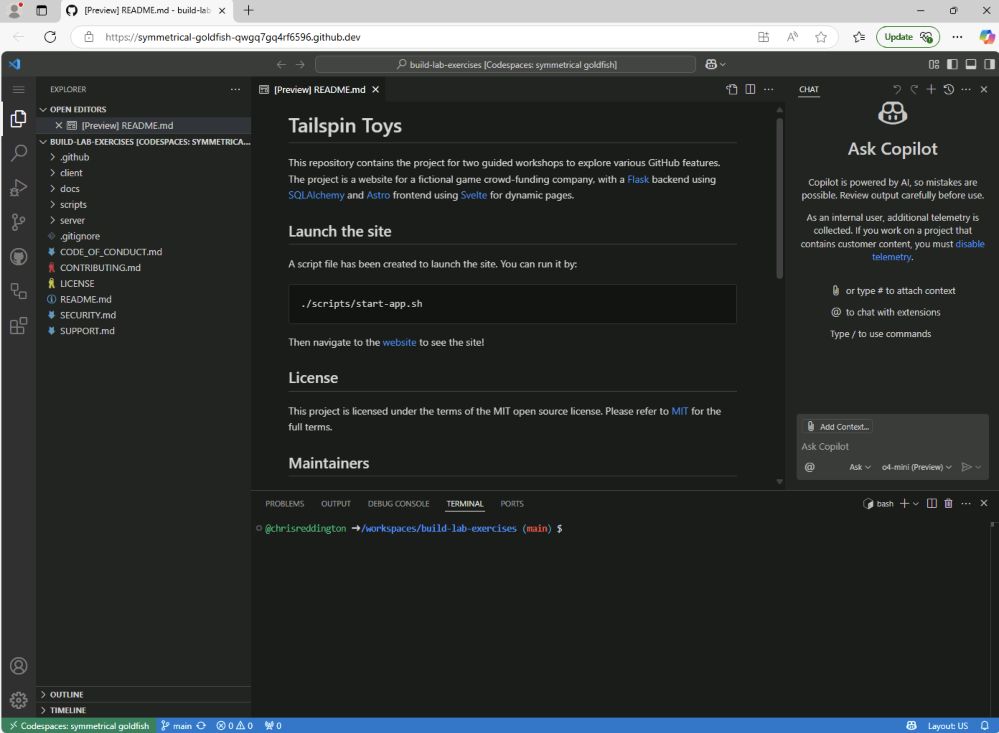

# Exercise 0: Prerequisites

Before starting the lab, please ensure you have completed the following setup steps.

## Setting up the Lab Repository

1. Navigate to the [GitHub Repository for this lab](https://github.com/github-samples/agents-in-sdlc).
2. Create your own copy of the repository by clicking the **Use this template** button on the lab repository page. Then click **Create a new repository**.

    

3. For labs at Microsoft build, please choose **Microsoft-Build-2025** as the GitHub organization. Set the repository name to something you'll remember for the rest of the lab, but be aware that name is visible to all other users also using the GitHub org.

    

> [!NOTE]
> This will create a new repository in your account with the same files and structure as the original lab repository.

We will be using this newly created repository to complete the lab exercises.

## Creating a GitHub Codespace

Next up, we will be using a GitHub Codespace to complete the lab exercises. GitHub Codespaces are a cloud-based development environment that allows you to write, run, and debug code directly in your browser. It provides a fully-featured IDE with support for multiple programming languages, extensions, and tools.

A GitHub Codespace is typically configured using the **.devcontainer/devcontainer.json** that contains the configuration files for the Codespace, specifying the base image, extensions, and settings for the Codespace. If there is no devcontainer configuration, the Codespace will spin up using a [universal (default) container image](https://github.com/devcontainers/images/tree/main/src/universal).

1. Navigate to your newly created repository.
2. Click on the green **Code** button.

    

3. Select the **Codespaces** tab and click the **+** button to create a new Codespace.

    

4. Wait for the Codespace to be created. This may take a few minutes depending on the container image size, the number of extensions being installed and any post install scripts that are being run. Please be patient while the Codespace is being created.

    

## Setup Complete

Congratulations, you have created a copy of the lab repository! Now, let's move on to the next step, learning about Model Context Protocol (MCP) and how you can provide GitHub Copilot Agent Mode access to a suite of tools.
