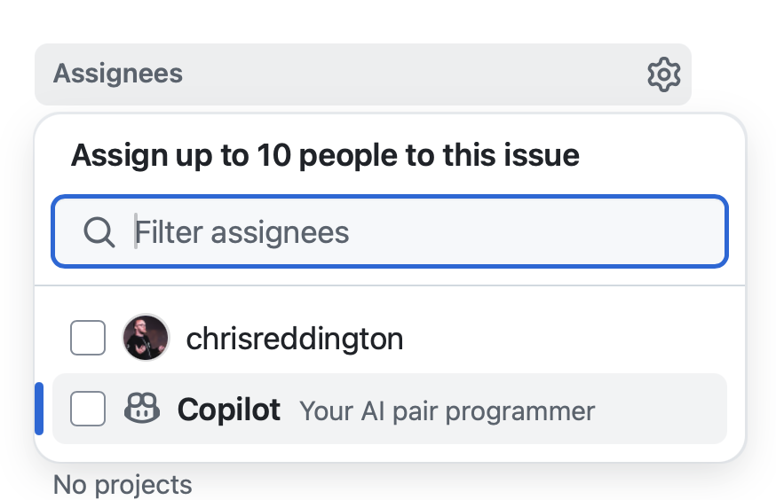
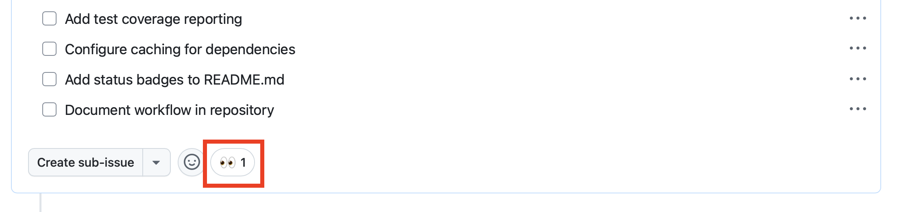
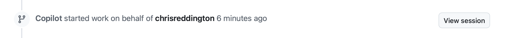
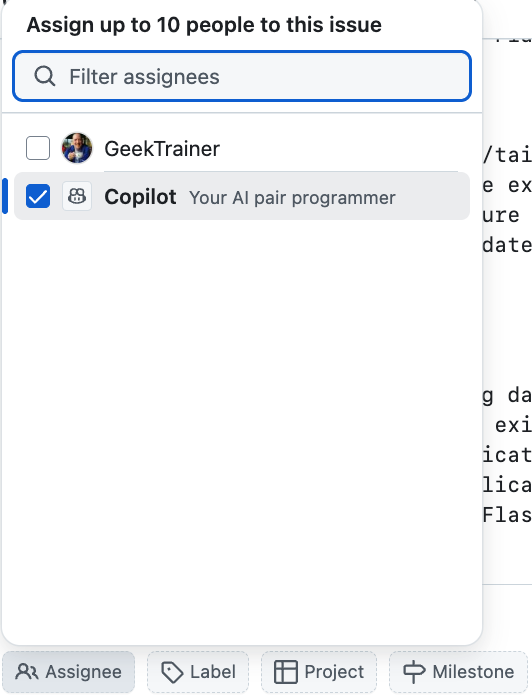

# Exercise 1 - GitHub Copilot coding agent

| [← Prerequisites][previous-lesson] | [Next lesson: MCP servers →][next-lesson] |
|:--|--:|

There are likely very few, if any, organizations who don't struggle with tech debt. This could be unresolved security issues, legacy code requiring updates, or feature requests which have languished on the backlog because we just didn't have the time to implement them. GitHub Copilot's coding agent is built to perform tasks such as updating code and adding functionality, all in an autonomous fashion. Once the agent completes its work, it generates a draft PR ready for a human developer to review. This allows offloading of tedious tasks and an acceleration of the development process, and frees developers to focus on larger picture items.

You'll explore the following with Copilot coding agent:

- customizing the environment for generating code.
- ensuring operations are performed securely.
- the importance of clearly scoped issues.
- assigning issues to Copilot.

## Scenarios

Tailspin Toys already has some tech debt they'd like to address. The contractors initially hired to create the first version of the site left the documentation in an unideal state - and by that we mean it's completely lacking. As a first step, they'd like to see docstrings or the equivalent added to all functions in the application.

Additionally, the design team is ready to get to work on building the UX for managing games. They don't need a full implementation yet, but they at least need some endpoints they can use for testing. Specifically, they need endpoints for the games API which will allow them to create, update and delete games. This is currently a blocker, but we have other issues which are of higher priority at the moment.

These are both examples of tasks which can quickly find themselves deprioritized, and are great to assign to Copilot coding agent. Copilot coding agent can then work on them asynchronously, allowing the developer to focus on other tasks, then return to review Copilot's work and ensure everything is as expected.

## Introducing GitHub Copilot coding agent

[GitHub Copilot coding agent][coding-agent-overview] can perform tasks in the background, much in the same way a human developer would. And, just like with working with a human developer, this is done by [assigning a GitHub issue to Copilot][assign-issue]. Once assigned, Copilot will create a draft pull request to track its progress, setup an environment, and begin working on the task. You can dig into Copilot's session while it's still in flight or after its completed. Once its ready for you to review the proposed solution, it'll tag you in the pull request!

## The importance of well-scoped instructions

While it can often feel like it, there is no magic in GitHub Copilot. There are no magic solutions available, where you can with just a couple of sentences snap your fingers and let AI perform the entire task for you. In fact, even seemingly straight-forward operations can often have fair amount of complexity when we peel back the layers.

As a result, we want to [be mindful about how we approach assigning tasks to Copilot coding agent][coding-agent-best-practices], and that working with Copilot as an AI pair programmer is typically the best approach. The approach you take tasks big and small is the same with or without Copilot - work in stages, learn, experiment, and adapt accordingly. As always, the fundamentals of software development do not change with the addition of generative AI.

## Setting up the dev environment for the Copilot coding agent

Creating code, regardless of who's involved, typically requires a specific environment and some setup scripts to be run to ensure everything is in a good state. This holds true when assigning tasks to Copilot, which is performing tasks in a similar fashion to a SWE.

[Copilot coding agent supports a special workflow][setup-workflow], set in the **.github/workflows/copilot-setup-steps.yml** file, to run before it gets to work. This enables it to have access to the required development tools and dependencies. We pre-configured this ahead of the lab to help the lab flow and allow this learning opportunity. It makes sure that Copilot had access to Python, Node.JS, and the required dependencies for the client and server:

```yaml
name: "Copilot Setup Steps"

# Allows you to test the setup steps from your repository's "Actions" tab
on: workflow_dispatch

jobs:
  copilot-setup-steps:
    runs-on: ubuntu-latest
    # Set the permissions to the lowest permissions possible needed for *your steps*. Copilot will be given its own token for its operations.
    permissions:
      # If you want to clone the repository as part of your setup steps, for example to install dependencies, you'll need the `contents: read` permission.
      # If you don't clone the repository in your setup steps, Copilot will do this for you automatically after the steps complete.
      contents: read
    steps:
      - name: Checkout code
        uses: actions/checkout@v4

      # Backend setup - Python
      - name: Set up Python
        uses: actions/setup-python@v4
        with:
          python-version: "3.13"
          cache: "pip"

      - name: Install Python dependencies
        run: ./scripts/setup-env.sh

      # Frontend setup - Node.js
      - name: Set up Node.js
        uses: actions/setup-node@v4
        with:
          node-version: "22"
          cache: "npm"
          cache-dependency-path: "./client/package.json"

      - name: Install JavaScript dependencies
        working-directory: ./client
        run: npm ci
```

It looks like any other GitHub workflow file, but it has a few key points:

- It contains a single job called **copilot-setup-steps**. This job is executed in GitHub Actions before Copilot starts working on the pull request.
- We've also added a **workflow_dispatch** trigger, which allows you to run the workflow manually from the Actions tab of your repository. This is useful for testing that the workflow runs successfully instead of waiting for Copilot to run it.

## Improving code documentation

While every developer and organization understands the importance of documentation, most projects have either outdated information or lack it altogether. This is the type of tech debt which often goes unaddressed, slowing productivity and making it more difficult to maintain the codebase or bring new developers into the team. Fortunately, Copilot shines at creating documentation, and this is a perfect issue to assign to Copilot coding agent. It'll work in the background to generate the necessary documentation. In a future exercise we'll return to review its work.

1. Navigate to your repository on github.com in a new browser tab.
2. Select the **Issues** tab.
3. Select **New issue** to open the new issue dialog.
4. Select **Blank issue** to create the new issue.
5. Set the **Title** to `Code lacks documentation`.
6. Set the **Description** to:
   
    ```plaintext
    Our organization has a requirement that all functions have docstrings or the language equivalent. Unfortunately, recent updates haven't followed this standard. We need to update the existing code to ensure docstrings (or the equivalent) are included with every function or method.
    ```

7. Select **Create** to create the issue.
8. On the right side, select **Assignees** to open the searchbox for contributors to the repository.
9. Select **Copilot** to assign the issue to Copilot.

  

10. Click somewhere else on the page to close the assignment window. Shortly after, you should see a set of 👀 on the first comment in the issue, indicating Copilot is on the job!

  

11. Select the **Pull Requests** tab.
12. Open the newly generated issue, which will be titled something similar to **[WIP]: Code lacks documentation**.
13. After a few minutes, you should see that Copilot has created a todo list.
14. Review the list and the tasks it's going to complete.
15.  Scroll down the pull request timeline, and you should see an update that Copilot has started working on the issue.
16.  Select the **View session** button.

  


> [!IMPORTANT]
> You may need to refresh the window to see the updated indicator.

17. Notice that you can scroll through the live session, and how Copilot is solving the problem. That includes exploring the code and understanding the state, how Copilot pauses to think and decide on the appropriate plan and also creating code.

This will likely take several minutes. One of the primary goals of Copilot coding agent is to allow it to perform tasks asynchronously, freeing us to focus on other tasks. We're going to take advantage of that very feature by both assigning another task to Copilot coding agent, then turning our attention to writing some code to add features to our application.

## Create new endpoints to modify games

As has been highlighted, one of the great advantages of GitHub Copilot coding agent is the ability to divide work, where you can focus on one set of tasks while it focuses on another. While creating the endpoints for modifying games for the design team might not necessarily take a long time, it's still time which could be used for other tasks. Let's assign it to Copilot coding agent!

1. Return to your repository on github.com.
2. Select the **Issues** tab.
3. Select **New issue** to open the new issue dialogue.
4. Select **Blank issue** to use the blank template.
5. Set the **Title** to: `Add endpoints to create and edit games`
6. Set the **Description** to:

    ```markdown
    We're going to be creating functionality in the future to allow for the submission (and editing) of games. For now we just want the endpoints so we can explore how we want to create the UX and do some acceptance testing. Our requirements are:

   - Add new endpoints to the Games API to support creating, updating and deleting games
   - There should be appropriate error handling for all new endpoints
   - There should be unit tests created for all new endpoints
   - Before creating the PR, ensure all tests pass
   ```

7. Note the level of guidance being provided to Copilot to help set everyone up for success.
8. Scroll towards the bottom of the dialog box to locate the **Assignee** button.
9. Select **Assignee** to open the dialog box to select assignees.
10. Select **Copilot** from the list.

    

11. Select **Create** to save the issue.
12. The newly created issue should now open.

Shortly after, you should see a set of 👀 on the first comment in the issue, indicating Copilot is on the job!


> [!IMPORTANT]
> You may need to refresh the window to see the updated indicator.

13. Select the **Pull Requests** tab.
14. Open the newly generated PR, which will be titled something similar to **[WIP]: Add endpoints to create and edit games**.
15. After a few minutes, Copilot will update the PR with a checklist of the tasks its going to perform. It will use this checklist to indicate to the outside world its progress.
16. Scroll down the pull request timeline, and you should see an update that Copilot has started working on the issue.
17. Select the **View session** button.

    

18. Notice that you can scroll through the live session, and how Copilot is solving the problem. That includes exploring the code and understanding the state, how Copilot pauses to think and decide on the appropriate plan and also creating code.

Copilot is now diligently working on your request! Copilot coding agent works in a similar fashion to a SWE, so we don't need to actively monitor it, but instead review once it's completed. Let's turn our attention to writing code and adding other features.

## Summary and next steps

This lesson explored [GitHub Copilot coding agent][copilot-agents], your AI peer programmer. With coding agent you can assign issues to Copilot to perform asynchronously. You can use Copilot to address tech debt, create new features, or aid in migrating code from one framework to another.

You explored the these concepts:

- customizing the environment for generating code.
- ensuring operations are performed securely.
- the importance of clearly scoped issues.
- assigning issues to Copilot.

With coding agent working diligently in the background, we can now turn our attention to our next lesson, [using MCP servers to interact with external services][next-lesson]. [Copilot coding agent can also use MCP servers][coding-agent-mcp], but we're going to switch back to our Codespace and try use MCP with Copilot agent mode.

## Resources

- [About Copilot coding agent][copilot-agents]
- [Assigning GitHub issues to Copilot][assign-issue]
- [Copilot coding agent setup workflow best practices][coding-agent-best-practices]

---

| [← Prerequisites][previous-lesson] | [Next lesson: MCP servers →][next-lesson] |
|:--|--:|

[coding-agent-overview]: https://docs.github.com/en/copilot/using-github-copilot/coding-agent/about-assigning-tasks-to-copilot#overview-of-copilot-coding-agent
[coding-agent-mcp]: https://docs.github.com/en/copilot/how-tos/agents/copilot-coding-agent/extending-copilot-coding-agent-with-mcp
[assign-issue]: https://docs.github.com/en/copilot/using-github-copilot/coding-agent/using-copilot-to-work-on-an-issue
[setup-workflow]: https://docs.github.com/en/copilot/using-github-copilot/coding-agent/best-practices-for-using-copilot-to-work-on-tasks#pre-installing-dependencies-in-github-copilots-environment
[copilot-agents]: https://docs.github.com/en/copilot/using-github-copilot/coding-agent/about-assigning-tasks-to-copilot
[coding-agent-best-practices]: https://docs.github.com/en/copilot/using-github-copilot/coding-agent/best-practices-for-using-copilot-to-work-on-tasks
[next-lesson]: ./2-mcp.md
[previous-lesson]: ./0-prereqs.md
