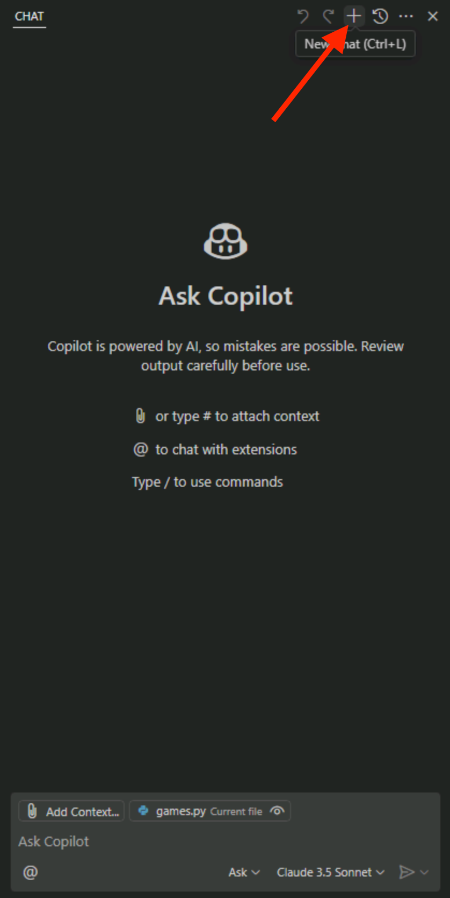
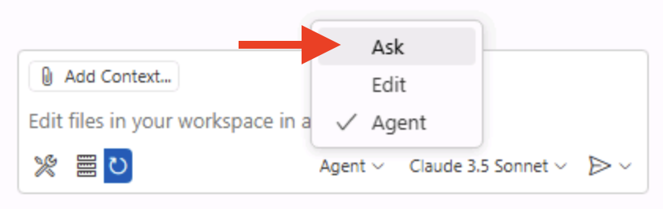
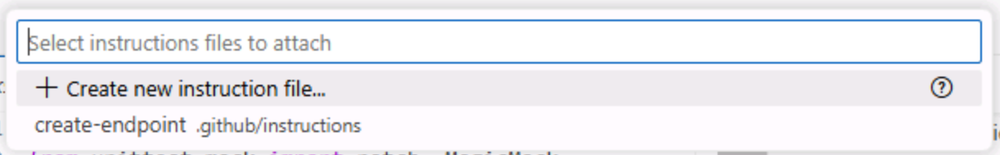
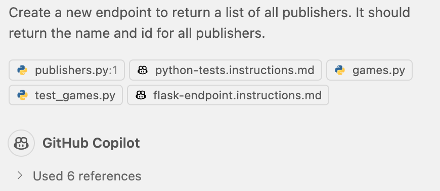
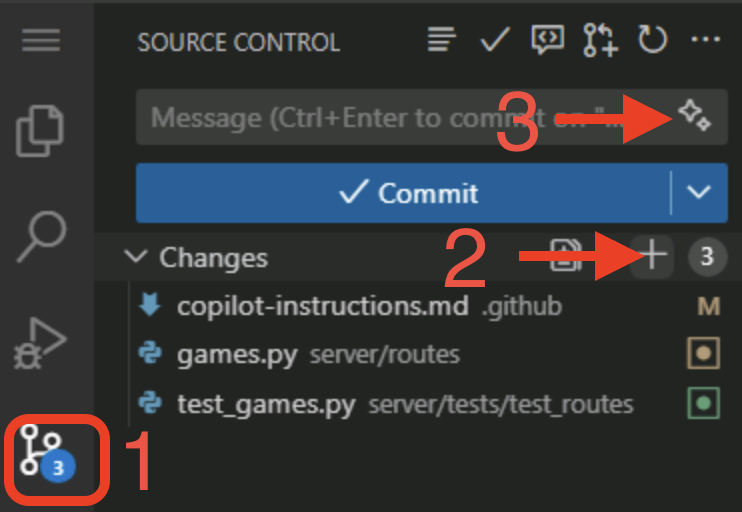

# Exercise 3 - Providing context to Copilot with instruction files

| [← Previous lesson: Model Context Protocol (MCP)][previous-lesson] | [Next lesson: Copilot agent mode →][next-lesson] |
|:--|--:|

Context is key across many aspects of life, and when working with generative AI. If you're performing a task which needs to be completed a particular way, or if a piece of background information is important, we want to ensure Copilot has access to that information. We can use [instruction files][instruction-files] to provide guidance so that Copilot not only understands what we want it to do but also how we want it to be done.

In this exercise, you will learn how to:

- provide Copilot with project-specific context, coding guidelines and documentation standards using custom instructions **.github/copilot-instructions.md**.
- use instruction files to guide Copilot for repetitive or templated tasks.
- implement both repository-wide instructions and task-specific instructions.

## Scenario

As any good dev shop, Tailspin Toys has a set of guidelines and requirements for development practices. These include:

- API always needs unit tests.
- UI should be in dark mode and have a modern feel.
- Documentation should be added to code in the form of docstrings and header comments.

Through the use of instruction files you'll ensure Copilot has the right information to perform the tasks in alignment with the practices highlighted.

## Before you begin

We're going to be making some code changes, so we should follow our usual practice of creating a new branch to work in. This will allow us to make changes without affecting the main branch until we're ready.

1. Return to your codespace from the previous exercise.
2. Open a new terminal window inside your codespace by selecting <kbd>Ctl</kbd>+<kbd>\`</kbd>.
3. Create and switch to a new branch by running the following command in the terminal:

   ```bash
   git checkout -b add-filters
   ```

## Custom instructions

Custom instructions allow you to provide context and preferences to Copilot chat, so that it can better understand your coding style and requirements. This is a powerful feature that can help you steer Copilot to get more relevant suggestions and code snippets. You can specify your preferred coding conventions, libraries, and even the types of comments you like to include in your code. You can create instructions for your entire repository, or for specific types of files for task-level context.

There are two types of instructions files:

- **.github/copilot-instructions.md**, a single instruction file sent to Copilot for **every** chat prompt. This file should contain project-level information, context which is relevant for every message. This could include the tech stack being used, an overview of what's being built, or global guidance for Copilot.
- **\*.instructions.md** files can be created for specific tasks or file types. You can use **.instructions.md** files to provide guidelines for particular languages (like Python or TypeScript), or for tasks like creating a React component or a new instance of a repository pattern.

> [!NOTE]
> When working in your IDE, instructions files are only used for code generation in Copilot Chat, and not used for code completions.

## Use GitHub Copilot Chat before updating custom instructions

To see the impact of custom instructions, we will start by sending a prompt with the current version of the files. We'll then make some updates, send the same prompt again, and note the difference.

1. Return to your codespace.
2. Close any open files in your codespace from the previous exercises. This will ensure Copilot has the context we want it to have.
3. Open **server/routes/publishers.py**, an empty file.
4. Open **Copilot chat** by selecting the Copilot icon towards the top of your codespace.
5. Create a new chat session by selecting the **New Chat** button, which will remove any previous context.

   

6. Select **Ask** from the modes dropdown.

   

7. Send the following prompt to create a new endpoint to return all publishers:

   ```plaintext
   Create a new endpoint to return a list of all publishers. It should return the name and id for all publishers.
   ```

8. Notice the generated code includes [type hints][python-type-hints] because, as we'll see, our custom instructions includes the directive to include them.
9. Notice the generated code **is missing** either a docstring or a comment header - or both!

> [!IMPORTANT]
> As highlighted previously, GitHub Copilot and LLM tools are probabilistic, not deterministic. As a result, the exact code generated may vary, and there's even a chance it'll abide by our rules without us spelling it out! But to aid consistency in code we should always document anything we want to ensure Copilot should understand about how we want our code generated.

## Add global standards to copilot-instructions.md

As highlighted previously, **copilot-instructions.md** is designed to provide project-level information to Copilot. Let's ensure global coding standards are documented to improve code suggestions from Copilot chat.

1. Return to your codespace.
2. Open **.github/copilot-instructions.md**.
3. Explore the file, noting the brief description of the project and sections for **Code standards**, **Scripts** and **GitHub Actions Workflows**. These are applicable to any interactions we'd have with Copilot, are robust, and provide clear guidance on what we're doing and how we want to accomplish it.
4. Locate the **Code formatting requirements** section, which should be around line 16. Note how it contains a note to use type hints. That's why we saw those in the code generated previously.
5. Add the following lines of markdown right below the note about type hints to instruct Copilot to add comment headers to files and docstrings:

   ```markdown
   - Every function should have docstrings or the language equivalent
   - Before imports or any code, add a comment block that explains the purpose of the file.
   ```

6. Close **copilot-instructions.md**.
7. Select **New Chat** in Copilot chat to clear the buffer and start a new conversation.
8. Return to **server/routes/publishers.py** to ensure focus is set correctly.
9.  Send the same prompt as before to create the endpoint.

   ```plaintext
   Create a new endpoint to return a list of all publishers. It should return the name and id for all publishers.
   ```

> [!TIP]
> You can cycle through previous prompts by using the up and down arrows on your keyboard.

8. Notice how the newly generated code includes a comment header at the top of the file which resembles the following:

   ```python
   """
   Publisher API routes for the Tailspin Toys Crowd Funding platform.
   This module provides endpoints to retrieve publisher information.
   """
   ```

9.  Notice how the newly generated code includes a docstring inside the function which resembles the following:

   ```python
   """
   Returns a list of all publishers with their id and name.
    
   Returns:
      Response: JSON response containing an array of publisher objects
   """
   ```

10. Also note how the existing code isn't updated, but of course we could ask Copilot to perform that operation if we so desired!

11. **Don't implement the suggested changes**, as we will be doing that in the next section.

From this section, you explored how the custom instructions file has provided Copilot with the context it needs to generate code that follows the established guidelines.

## Instruction files for tasks

Coding is often repetitive, with developers performing similar tasks on a regular basis. Copilot is wonderful for allowing you to offload these types of tasks. But these types of tasks, like adding an endpoint, creating a component, or adding a new service pattern implementation often require a particular template or structure to be followed. Instruction files allow you to provide specific requirements for these types of tasks. They can be added manually when using Copilot Chat, or can have an **applyTo:** tag added to the top of the file to have Copilot automatically use them for specific files.

We want to create a new endpoint to list all publishers, and to follow the same pattern we used for the existing [games endpoints][games-endpoints], and to create tests which follow the same pattern as the existing [games endpoints tests][games-tests]. An instruction file has already been created; let's explore it and see the difference in code it generates.

1. Open **.github/instructions/python-tests.instructions.md**.
2. Note the **applyTo:** section at the top, which contains a filter for all files in the **server/tests** directory which start with **test_** and have a **.py** extension. Whenever Copilot Chat interacts with a file which matches this pattern it will automatically use the guidance provided in this file.
3. Note the file contains guidance about how tests should be created, and how to utilize SQLite when testing database functionality.
4. Open **.github/instructions/flask-endpoint.instructions.md**.
5. Review the following entries inside the instruction file, which includes:

   - an overview of requirements, including that tests must be created, and endpoints are created in Flask using blueprints.
   - a link to another the previously mentioned **python-tests.instructions.md** file.
   - links to two existing files which follow the patterns we want - both the games blueprint and tests. Notice how these are setup as normal markdown links, allowing an instruction file to incorporate additional files for context.

6. Return to **server/routes/publishers.py** to ensure focus is set correctly.
7. Return to Copilot Chat and select **New Chat** to start a new session.
8. Select **Edit** from the mode dropdown, which will allow Copilot to update multiple files. 

   

> [!NOTE]
> If you have any issues running the tests in this part of the exercise, please undo your changes and retry from the above step using **Agent** mode instead.

9. Select the **Add Context** button to open the context dialog
10. If prompted to allow the codespace to see text and images copied to the clipboard, select **Allow**.
11. Select **Instructions** from the dropdown at the top of your codespace.

> [!TIP]
> If the list of options is long, you can type **instructions** to filter to the Instructions option then select **Instructions**.

12.  Select **flask-endpoint .github/instructions** to add the instruction file to the context.

   

13. Send the same prompt as before to generate the desired endpoint:

   ```plaintext
   Create a new endpoint to return a list of all publishers. It should return the name and id for all publishers.
   ```

14. Note the **References** section and how it uses the **flask-endpoint.instructions.md** file to provide context. If you use instructions files with Copilot agent mode, you will notice that Copilot explores and reads the files referenced in the instructions file.

   

15. Copilot generates the files. Notice how it generates updates across multiple files, like **publishers.py** and **test_publishers.py**

> [!NOTE]
> Note that the code generated may diverge from some of the standards we set. AI tools like Copilot are non-deterministic, and may not always provide the same result. The other files in our codebase do not contain docstrings or comment headers, which could lead Copilot in another direction. Consistency is key, so making sure that your code follows the established patterns is important. You can always follow-up in chat and ask Copilot to follow your coding standards, which will help guide it in the right direction.

16. After reviewing the code, select **Keep** in Copilot Chat to accept the changes.
17. Open a terminal window by selecting <kbd>Ctl</kbd>+<kbd>\`</kbd>.
18. Run the tests by running the script with the following command:

   ```sh
   ./scripts/run-server-tests.sh
   ```

19. Once the code is correct, and all tests pass, open the **Source Control** panel on the left of the Codespace and review the changes made by Copilot.
20. Stage the changes by selecting the **+** icon in the **Source Control** panel.
21. Generate a commit message using the **Sparkle** button.

    

22. Commit the changes to your repository by selecting **Commit**.

## Summary and next steps

Congratulations! You explored how to ensure Copilot has the right context to generate code following the practices your organization has set forth. This can be done at a repository level with the **.github/copilot-instructions.md** file, or on a task basis with instruction files. You explored how to:

- provide Copilot with project-specific context, coding guidelines and documentation standards using custom instructions (.github/copilot-instructions.md).
- use instruction files to guide Copilot for repetitive or templated tasks.
- implement both repository-wide instructions and task-specific instructions.

Next we'll use [agent mode to add functionality to the site][next-lesson].

## Resources

- [Instruction files for GitHub Copilot customization][instruction-files]
- [Best practices for creating custom instructions][instructions-best-practices]
- [Personal custom instructions for GitHub Copilot][personal-instructions]

---

| [← Previous lesson: Model Context Protocol (MCP)][previous-lesson] | [Next lesson: Copilot agent mode →][next-lesson] |
|:--|--:|

[previous-lesson]: ./2-mcp.md
[next-lesson]: ./4-copilot-agent-mode-vscode.md
[instruction-files]: https://code.visualstudio.com/docs/copilot/copilot-customization
[python-type-hints]: https://docs.python.org/3/library/typing.html
[games-endpoints]: ../server/routes/games.py
[games-tests]: ../server/tests/test_routes/test_games.py
[instructions-best-practices]: https://docs.github.com/en/enterprise-cloud@latest/copilot/using-github-copilot/coding-agent/best-practices-for-using-copilot-to-work-on-tasks#adding-custom-instructions-to-your-repository
[personal-instructions]: https://docs.github.com/en/copilot/customizing-copilot/adding-personal-custom-instructions-for-github-copilot
