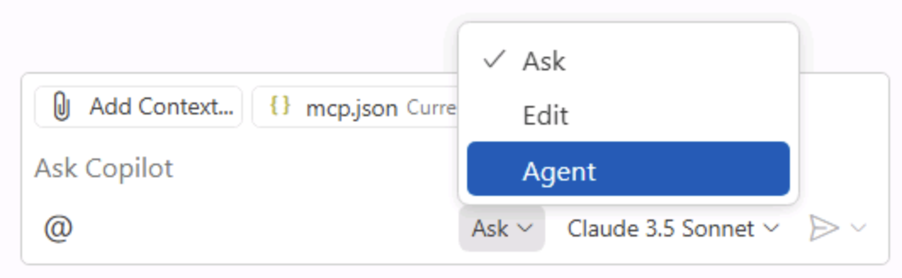
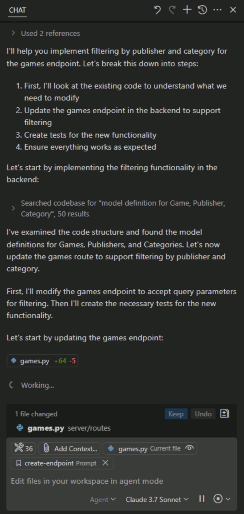
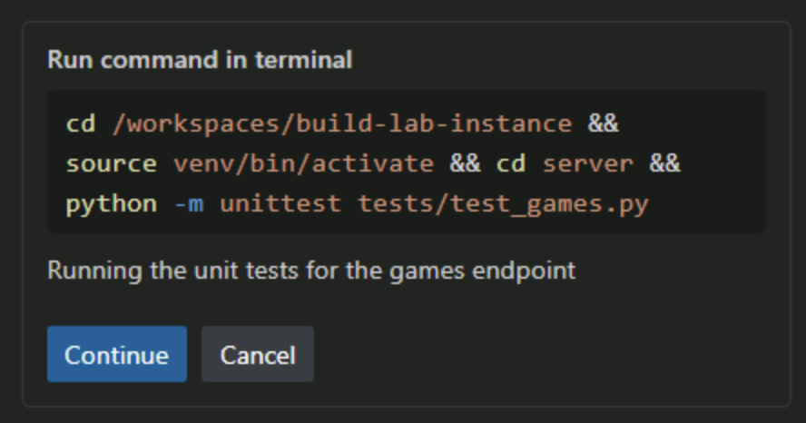
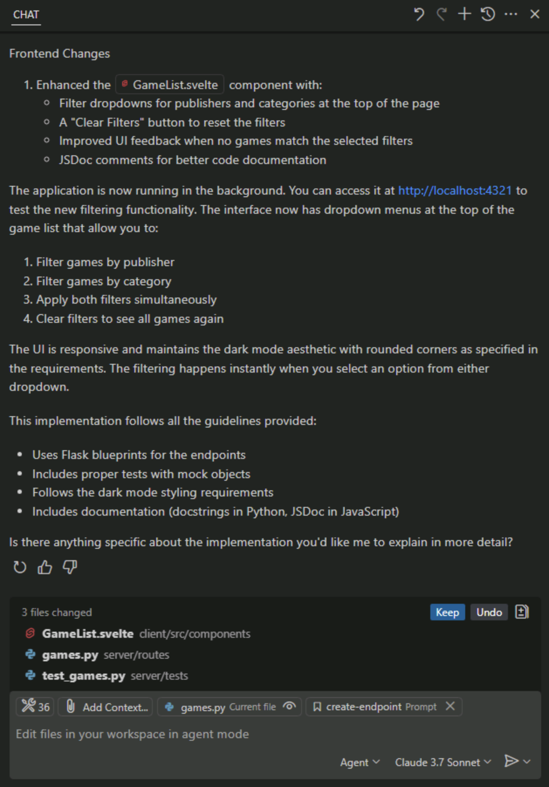
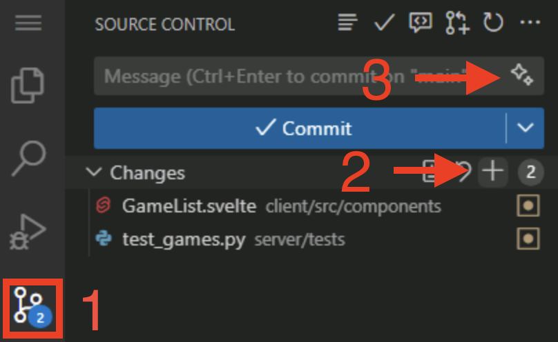

# Exercise 4 - Adding new functionality with Copilot Agent Mode

| [← Previous lesson: Custom instructions][previous-lesson] | [Next lesson: Reviewing coding agent →][next-lesson] |
|:--|--:|

Even the simplest of updates to an application typically require updates to multiple files and operations to be performed like running tests. As a developer your flow typically involves tracking down all the necessary files, making the changes, running the tests, debugging, figuring out which file was missed, making another update... The list goes on and on.

This is where Copilot Agent Mode comes into play.

Copilot Agent Mode is built to act more autonomously. It behaves in a similar fashion to a developer, starting by exploring the existing project structure, performing the necessary updates, running tasks like tests, and automatically fixing any discovered mistakes. Let's explore how we can use Agent Mode to introduce new functionality to our site.

In this exercise, you will learn how:

- GitHub Copilot Agent Mode can implement new features across both backend and frontend codebases.
- Copilot Agent Mode can explore your project, identify relevant files, and make coordinated changes.
- to review changes and tests generated by Copilot Agent Mode before merging into your codebase.

## Scenario

As the list of games grows, you want to allow users to filter by category. This will require updating both the API and UI, and updating the tests for the API. With the help of Copilot Agent Mode you'll work with your AI pair programmer to add the new feature! 

## Running the Tailspin Toys website

Before we make any changes, let's explore the Tailspin Toys website to understand its current functionality. 

The website is a crowdfunding platform for board games with a developer theme. It allows users to list games and display details about them. The website has two main components: the front-end (written in Svelte) and the backend (written in Python).

### Starting the website

To make running the website easier, we have provided a script that will start both the front-end and back-end servers. You can run this script in your GitHub Codespace to start the website with the following instructions:

1. Return to your codespace. We'll continue working in your current branch.
2. Open a new terminal window inside your codespace by selecting <kbd>Ctl</kbd>+<kbd>\`</kbd>.
3. Run the following script to start the website:

   ```bash
   scripts/start-app.sh
   ```

   Once the script is running, you should see output indicating that both the front-end and back-end servers are running, similar to the below:

   ```bash
   Server (Flask) running at: http://localhost:5100
   Client (Astro) server running at: http://localhost:4321
   ```

> [!NOTE]
> If a dialog box opens prompting you to open a browser window for http://localhost:5100 close it by selecting the **x**.

4. Open the website by using <kbd>Ctrl</kbd>-**Click** (or <kbd>Cmd</kbd>-**Click** on a Mac) on the client address (http://localhost:4321) in the terminal.

> [!NOTE]
> When using a codespace, selecting a link for the localhost URL from the Codespace terminal will automatically redirect you to `https://<your-codespace-name>-4321.app.github.dev/`. This is a private tunnel to your codespace, which is now hosting your web server!

### Exploring the website

Once the website is running, you can explore its functionality. The main features of the website include:

- **Home Page**: Displays a list of board games with their titles, images, and descriptions.
- **Game Details Page**: When you select a game, you'll be brought to a details page with more information about the game, including its title, description, publisher and category.

## Explore the backlog with Copilot

The initial implementation of the website is functional, but we want to enhance it by adding new capabilities. Let's start off by reviewing the backlog. Ask GitHub Copilot to show you the backlog of items that we created in the previous exercise.

1. Return to your codespace.
2. Open **Copilot Chat**.
3. Create a new chat session by selecting the **New Chat** button, which will remove any previous context.
4. Ensure **Agent** is selected from the list of modes.

   

5. Select **Claude 3.5 Sonnet** from the list of available models.

> [!IMPORTANT]
> The authors of this lab are not indicating a preference towards one model or another. When building this lab, we used Claude 3.5, and as such are including that in the instructions. The hope is the code suggestions you receive will be relatively consistent to ensure a good experience. However, because LLMs are probabilistic, you may notice the suggestions received differ from what is indicated in the lab. This is perfectly normal and expected.

5. Ask Copilot about the backlog of issues by sending the following prompt to Copilot, replacing **<YOUR_REPOSITORY_PATH>** with the organization/name of your repository which you noted earlier:

   ```plaintext
   Please show me the backlog of items from my repository at <YOUR_REPOSITORY_PATH>. Help me prioritize them based on those which will be most useful to the user.
   ```

6. Notice GitHub Copilot (likely) identifies **list_issues** as the MCP command to run to access the right information.

> [!NOTE]
> Because of the probabilistic nature of LLMs, Copilot may utilize a different MCP command, but should still be able to complete the task.

7. Select **Continue** to run the command to list all issues.
8. Review the generated list of issues.

Notice how Copilot has even prioritized the items for us, based on the ones that it thinks will be most useful to the user.

## Implement the filtering functionality

To implement filtering, no less than three separate updates will need to be made to the application:

- A new endpoint added to the API
- A new set of tests for the new endpoint
- Updates to the UI to introduce the functionality

In addition, the tests need to run (and pass) before we merge everything into our Codebase. Copilot Agent Mode can perform these tasks for us! Let's add the functionality.

1. You can continue in the current conversation with Copilot, or start a new one by selecting **New Chat**.
2. Select **Add Context**, **Instructions**, and **flask-endpoint .github/instructions**  as the instructions file.

   

> [!NOTE]
> Even though Copilot agent mode may have discovered this file on its own, if you're aware of an important piece of information, like a **.instructions.md** file, then absolutely add it to Copilot's context. This helps set Copilot (and you) up for success.

3. Ensure **Agent** mode is still selected.

   

4. Ensure **Claude 3.5** is still selected for the model.
5. Prompt Copilot to implement the functionality based on the issue we created earlier by using the following prompt, replacing **<YOUR_REPOSITORY_PATH>** with the organization/name of your repository which you noted earlier:

   ```plaintext
   Please update the site to include filtering by publisher and category based on the requirements from the related GitHub issue in the backlog of <YOUR_REPOSITORY_PATH>.
   ```

6. Watch as Copilot begins by exploring the project, locating the files associated with the desired functionality. You should see it finding both the API and UI definitions, as well as the tests. It then begins modifying the files and running the tests.

   

> [!NOTE]
> You will notice that Copilot will perform several tasks, like exploring the project, modifying files, and running tests. It may take a few minutes depending on the complexity of the task and the codebase. During that process, you may notice **Keep** and **Undo**  buttons appear in the code editor. When Copilot is finished, you will have a **Keep** or **Undo** for all of the changes, so you do not need to select them while work is in progress.

6. As prompted by Copilot, select **Continue** to run the tests.

   

7. You may see some tests fail throughout the process, and that's okay! Copilot may work back and forth between code generation and tests until it completes the task and doesn't detect any errors.

   

8. Explore the generated code for any potential issues.

> [!IMPORTANT]
> Remember, it's always important to review the code that Copilot or any AI tools  generate.

9.  Return to the browser with the website running. Explore the new functionality!
10. Once you've confirmed everything works and reviewed the code, select **Keep** in the Copilot Chat window.

## Publish the branch

With our changes created locally we're ready to create a pull request (PR) to allow for our team to review our suggested changes and work through our DevOps process. The first step in that process is to publish the branch. Let's take care of that first.

1. Navigate to the **Source Control** panel in the Codespace and review the changes made by Copilot.
2. Stage the changes by selecting the **+** icon.
3. Generate a commit message using the **Sparkle** button.

   

4. Select **Publish** to push the branch to your repository.

## Create the pull request

There are several ways to create a pull request, including through github.com and the GitHub command-line interface (CLI). But since we're already working with GitHub Copilot, let's let it create the PR for us! We can have it find the relevant issue and create the PR with an association to the located issue. 

1. Navigate to the Copilot Chat panel and select **New Chat** to start a new session.
2. Ask Copilot to create a PR for you, replacing **<YOUR_REPOSITORY_PATH>** with the organization/name of your repository which you noted earlier:

   ```plaintext
   Find the issue related to filtering by category and publisher on <YOUR_REPOSITORY_PATH>. Create a new pull request for the current add-filters branch, and associate it with the correct issue.
   ```

3. As needed, select **Continue** to allow Copilot to perform the tasks necessary to gather information and perform operations.
4. Notice how Copilot searches through the issues, finds the right one, and creates the PR.
5. Select the link generated by Copilot to review your pull request, but please **don't merge it yet**.

## Summary and next steps

Congratulations! In this exercise, we explored how to use GitHub Copilot Agent Mode to add new capabilities to the Tailspin Toys website. We learned how:

- GitHub Copilot Agent Mode can implement new features across both backend and frontend codebases.
- Copilot Agent Mode can explore your project, identify relevant files, and make coordinated changes.
- to review changes and tests generated by Copilot Agent Mode before merging into your codebase.

Now let's [return to our coding agent][next-lesson] to see how well it did with the issues we assigned to it.

### Bonus exploration exercise – Implement paging

As the list of games grows there will be a need for paging to be enabled. Using the skills you learned in this exercise, prompt Copilot to update the site to implement paging. Some considerations for the code include:

- follow the existing best practices, including using the existing (or creating a new) prompt file.
- consider how you want paging implemented, if you want to allow the user to select the page size or for it to be hard-coded.
- as you create the prompt ensure you provide Copilot with the necessary guidance to create the implementation as you desire.
- you may need to iterate with GitHub Copilot, asking for changes and providing context. This is the normal flow when working with Copilot!

## Resources

- [Coding agent 101][coding-agent-101]
- [Copilot ask, edit, and agent modes: What they do and when to use them
][choose-mode]
- [Agent mode in VS Code][vs-code-agent-mode]

---

| [← Previous lesson: Custom instructions][previous-lesson] | [Next lesson: Reviewing coding agent →][next-lesson] |
|:--|--:|

[previous-lesson]: ./3-custom-instructions.md
[next-lesson]: ./5-reviewing-coding-agent.md
[coding-agent-101]: https://github.blog/ai-and-ml/github-copilot/agent-mode-101-all-about-github-copilots-powerful-mode/
[choose-mode]: https://github.blog/ai-and-ml/github-copilot/copilot-ask-edit-and-agent-modes-what-they-do-and-when-to-use-them/
[vs-code-agent-mode]: https://code.visualstudio.com/docs/copilot/chat/chat-agent-mode
