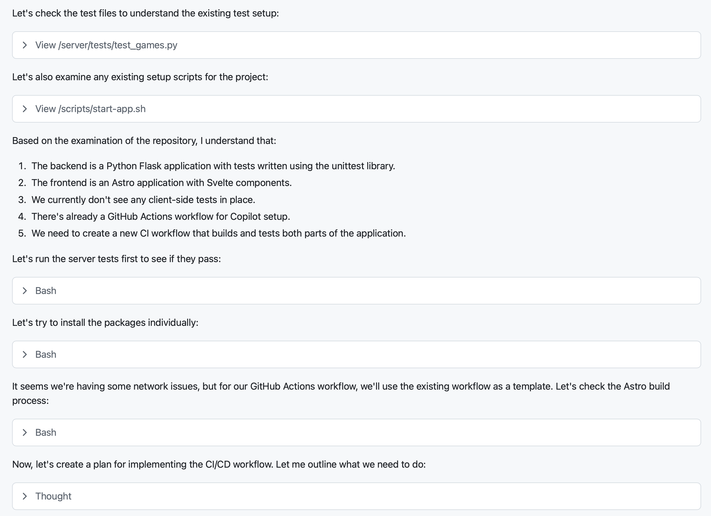
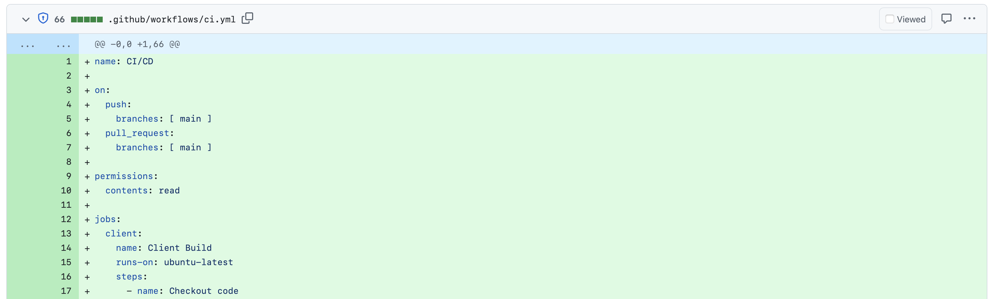
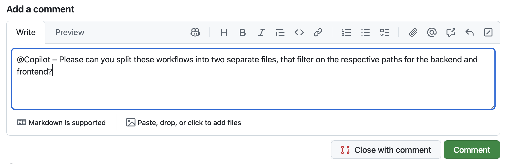
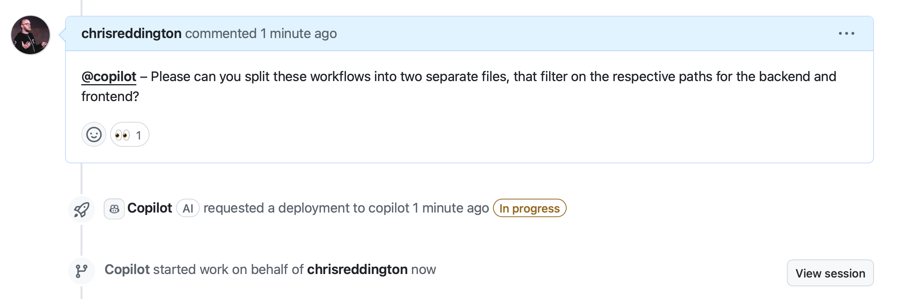
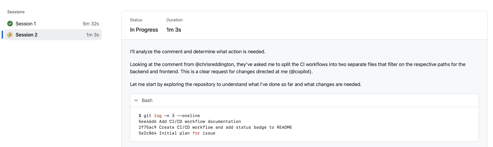
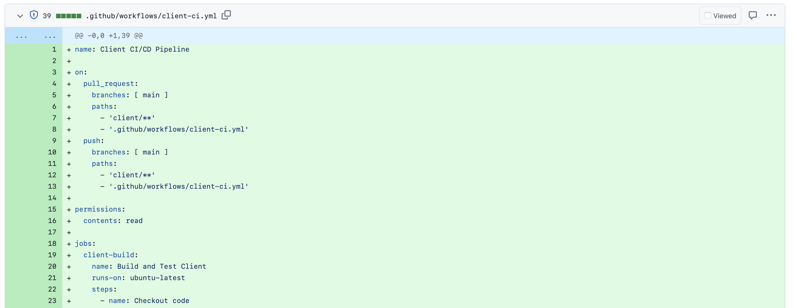

# GitHub Copilot coding agent

There are likely very few, if any, organizations who don't struggle with tech debt. This could be unresolved security issues, legacy code requiring updates, or feature requests which have languished on the backlog because we just didn't have the time to implement them. GitHub Coppilot's coding agent is built to perform tasks such as updating code and adding functionality, all in an autonomous fashion. Once the agent completes its work, it generates a draft PR ready for a human developer to review. This allows offloading of tedious tasks and an acceleration of the development process, and frees developers to focus on larger picture items. 

Let's first explore how we can use the Copilot coding agent to create a GitHub Actions workflow to help us maintain the quality of our app. Then, we'll discuss the importance of well-scoped issues, and explore how it could support migration from one language and framework to another.

## Setting up the Dev Environment for the Copilot coding agent

Creating code, regardless of who's involved, typically requires a specific environment and some setup scripts to be run to ensure everything is in a good state. This holds true when assigning tasks to Copilot, which is performing tasks in a similar fashion to a SWE.

Copilot coding agent supports a special workflow, set in the `.github/workflows/copilot-setup-steps.yml` file, to run before it gets to work. This enables it to have access to the required development tools and dependencies. We pre-configured this ahead of the lab to help the lab flow and allow this learning opportunity. It makes sure that Copilot had access to Python, Node.JS, the .NET 9.0 SDK, and the required dependencies for the client and server:

```yaml
name: "Copilot Setup Steps"

# Allows you to test the setup steps from your repository's "Actions" tab
on: workflow_dispatch

jobs:
  copilot-setup-steps:
    runs-on: ubuntu-latest
    # Set the permissions to the lowest permissions possible needed for *your steps*. Copilot will be given its own token for its operations.
    permissions:
      # If you want to clone the repository as part of your setup steps, for example to install dependencies, you'll need the `contents: read` permission.
      # If you don't clone the repository in your setup steps, Copilot will do this for you automatically after the steps complete.
      contents: read
    steps:
      - name: Checkout code
        uses: actions/checkout@v4

      # Backend setup - Python
      - name: Set up Python
        uses: actions/setup-python@v4
        with:
          python-version: "3.13"
          cache: "pip"

      - name: Install Python dependencies
        working-directory: ./server
        run: pip install -r requirements.txt

      # Frontend setup - Node.js
      - name: Set up Node.js
        uses: actions/setup-node@v4
        with:
          node-version: "22"
          cache: "npm"
          cache-dependency-path: "./client/package.json"

      - name: Install JavaScript dependencies
        working-directory: ./client
        run: npm ci

      # .NET setup
      - name: Setup .NET
        uses: actions/setup-dotnet@v3
        with:
          dotnet-version: '9.0.x'
      
      - name: Display .NET version
        run: dotnet --version
```

It looks like any other GitHub workflow file, but it has a few key points:

- It contains a single job called `copilot-setup-steps`. This job is executed in GitHub Actions before Copilot starts working on the pull request.
- We've also added a `workflow_dispatch` trigger, which allows you to run the workflow manually from the Actions tab of your repository. This is useful for testing that the workflow runs successfully ahead of waiting for Copilot to run it.

You can find out more about customizing the development environment for Copilot coding agent in the [GitHub documentation](#TODO).

## Scenario – Improving quality checks with GitHub Actions

Bringing quality checks into our CI/CD pipeline is a great way to ensure that the code we are writing is of high quality, and maintain high velocity. This is an important aspect to consider when working with AI or other members of the team. These checks also help us when we're reviewing changes from tools like Dependabot or GitHub Copilot, and whether our code still compiles and passes some established baseline.

1. Navigate to your repository on github.com.
2. Select the **Issues** tab.
3. Open the issue associated with creating a GitHub Actions workflow; it should have a title similar to **Add GitHub Actions workflow for building and testing client and server**.
4. On the right side, select **Assignees** to open the searchbox for contributors to the repository.
5. Select **Copilot** to assign the issue to Copilot.

  

Shortly after, you should see a set of 👀 on the first comment in the issue, indicating Copilot is on the job!

  

6. Select the **Pull Requests** tab.
7. Open the newly generated issue, which will be titled something similar to **[WIP]: Add GitHub Actions workflow for building and testing client and server**.
8. Notice how Copilot has created a todo list.
9. Review the list and the tasks it's going to complete.
10. Scroll down the pull request timeline, and you should see an update that Copilot has started working on the issue.
11. Select the **View session** button.

  

12. Notice that you can scroll through the live session, and how Copilot is solving the problem. That includes exploring the code and understanding the state, how Copilot pauses to think and decide on the appropriate plan and also creating code.

  

13. Scroll to the top of the session and select the **Back to pull request** link to return to the pull request.

  

While Copilot works in the background, let's turn our attention to another, larger task: Migrating the backend to .NET 9.0.

## Scenario - Migrating the backend server to .NET

When the project was first created Flask was the right choice for the backend. However, the newly hired developers are more experienced in .NET and C#, and want to take this opportunity to migrate the application to better align with their skill set. Rather than performing the migration completely by hand, they want to automate the first draft of it, and turn their attention to making improvements.

> [!NOTE]
> The authors of this lab are huge fans of Flask. The task of migrating from Flask to C# is an allegory, a representation of how you might use Copilot to aid in upgrading a Python 2 app to Python 3, or from COBOL to Java. It is not meant to imply one framework is better than another.

### The importance of well-scoped instructions

As you've likely experienced, performing a task like migrating an application from one language and framework to another, or even updating from an older version to a newer one, is rather complex. There are no magic solutions available, where you can with just a couple of sentences snap your fingers and let AI perform the entire operation for you. In fact, even this seemingly straight-forward operation has a fair amount of complexity.

As a result, we want to be mindful about how we approach these types of large tasks, and that working with Copilot as an AI pair programmer is typically the best approach. The approach you take for larger projects is the same with or without Copilot - work in stages, learn, experiment, and adapt accordingly. As has been highlighted previously, the fundamentals do not change with the addition of generative AI.

The requirements for migrating our backend include several steps which need to be accomplished:

- A new project needs to be created.
- A new set of models needs to be established in .NET for the existing database.
- The functionality needs to be recreated in .NET.
- Unit tests need to be created for the new .NET implementation.

If we attempted the migration with a simple prompt like "Perform the migration from Flask to .NET," we likely wouldn't be pleased with the output. This would hold true when working with Copilot or a fellow developer as it doesn't provide enough context. We want our prompt to include as many details as possible to help guide Copilot to the best possible output.

## Create the issue for migrating the backend and assign it to Copilot

Let's create a detailed issue for migrating the backend from Flask to .NET.

> [!IMPORTANT]
> After assigning the issue, Copilot may take up to 20 minutes to complete the task. Depending on timing this may mean it completes after the time allotted for this lab. We wanted to ensure you explored this common use case for Copilot, so we included it in the lab.

1. Return to your repository on github.com.
2. Select the **Issues** tab.
3. Select **New issue** to open the new issue dialogue.
4. Select **Blank issue** to use the blank template.
5. Set the **Title** to: `Migrate Flask backend to .NET 9.0`
6. Set the **Description** to:

    ```markdown
    We need to migrate the backend from Flask to .NET 9. Let's use this approach:

    ## Requirements:

    - Use the existing database at data/tailspin-toys.db
    - Keep the same functionality as the existing application
    - Update the startup scripts to ensure the client continues to work seamlessly
    - Unit tests are created for the updated backend

    ## Proposed flow

    - Create the .NET 9.0 project
    - Export the schema for the existing database
    - Create the EF models based on the existing schema
    - Create the endpoints for the application
    - Create the unit tests for the application
    - Update the scripts to remove the Flask app and run the .NET app, ensuring the port number is the same
    ```

7. Note the level of guidance being provided to Copilot to help set everyone up for success.
8. Select **Save** to save the issue.
9. The newly created issue should now open.
10. On the right side, select **Assignees** to open the searchbox for contributors to the repository.
11. Select **Copilot** to assign the issue to Copilot.

    

Shortly after, you should see a set of 👀 on the first comment in the issue, indicating Copilot is on the job!


6. Select the **Pull Requests** tab.
7. Open the newly generated issue, which will be titled something similar to **[WIP]: Migrate Flask backend to .NET 9.0**.
8. Notice how Copilot has created a todo list.
9. Review the list and the tasks it's going to complete.
10. Scroll down the pull request timeline, and you should see an update that Copilot has started working on the issue.
11. Select the **View session** button.

    

12. Notice that you can scroll through the live session, and how Copilot is solving the problem. That includes exploring the code and understanding the state, how Copilot pauses to think and decide on the appropriate plan and also creating code.

Copilot is now diligently working on your request! Copilot coding agent works in a similar fashion to a SWE, so we don't need to actively monitor it as we've done previously, but instead review asynchronously. Let's return to the prior task we assigned it, creating a workflow, to see how it got on.

## Reviewing the results

As has been highlighted numerous times, the fundamentals of software design and DevOps do not change with the additional of generative AI. We always want to review the code generated, and work through our normal DevOps process. With that in mind, let's review the suggestions from GitHub Copilot for creating the workflow.

1. Return to your repository on github.com.
2. Select **Pull Requests** to open the list of pull requests.
3. Open issue titled something similar to **Add GitHub Actions workflow for building and testing client and server**.

> [!NOTE]
> If Copilot is still working on the task, the issue will contain the **WIP** flag. If so, wait for Copilot to complete the work. This may take a few minutes, so feel free to take a break, or reflect on everything you've learned so far.

4.  Once the pull request is ready, select the **Files changed** tab and review the changes.

    

5. Explore the newly created workflow file in the `.github/workflows` folder which contains the steps needed to build and test the client and server.

    

6. Once you've reviewed the syntax, navigate back to the **Conversation** tab and scroll down. You should see an indicator that some workflows are waiting for approval.
7. Click on the **Approve and run workflows** button to allow the workflows to run.

    

8.  You should see the workflows get queued in the checks section of the pull request. All being well, you should see that the workflows pass for both the client and server (for the JavaScript and Python implementation, as that's the version still in the main branch).

Working with Copilot on a pull request is not just a one-way street. You can also add comments to the pull request, or inline comments to the code. Copilot will see these comments, and trigger another session to address them. Due to the non-deterministic results, we can't give prescriptive text of what to ask for. In the example below, you can see we ask Copilot to add more comments to the GitHub Actions workflow, or to split the single workflow file into separate workflows, one for the client and one for the server.

9. Add a comment requesting a change to the workflow. For example, maybe request that Copilot split the workflow into two separate files, one for the frontend and another for the backend.
 
    

10. Feel free to watch the session as Copilot works on the changes.

    

11. Select **View Session** to watch Copilot perform its work. Notice how Copilot starts a new session to make the updates.

    

12. You can select **Back to pull request** to return to the pull request.

    

21. Once Copilot has completed the changes, you should see a new commit in the pull request.
22. Select the **Files changed** tab to review the changes. In our example, we saw that Copilot had split the workflow file into two separate files, one for the client and one for the server.

    

Feel free to continue iterating on this GitHub Action Workflows file until you are happy. Once happy, you can convert the PR to ready from a draft, and merge it into the main branch.


## Instructor led discussion

> [!NOTE]
> As highlighted previously, because of the amount of work involved in the migration, Copilot may take up to 20 minutes to complete the task. In this author's most recent run, Copilot took just under 15 minutes. This is still certainly faster than performing the task manually, but may cause some timing issues. As a result, Copilot might not complete the task in the time allotted.
>
> To highlight the full functionality of Copilot, the instructors started an issue at the beginning of the presentation. We're going to demonstrate the results, and see - **LIVE** - how everything turned out. What could possibly go wrong?

Watch along as the instructors show off what Copilot was able to accomplish with the instructions provided for the migration exercise.

## Optional Exercise - Review the migration

If Copilot has completed its work on migrating the backend from Flask to .NET, let's review its work and see the results.

1. Return to your repository on github.com.
2. Select **Pull Requests** to list your pull requests.
3. Select the pull request titled something similar to **Migrate Flask backend to .NET 9.0**.

> [!NOTE]
> If Copilot is still working it will have the **[WIP]** flag. If that's the case, you can wait while it completes the task.

4. If the work has been complete, select the **Files changed** tab to review the code generated.
5. Note how Copilot created a new folder for the server, updated the script, and performed other related tasks.

## Optional Exercise - Explore how custom instructions steer the agent

You have already seen how custom instructions can be used to guide Copilot in the IDE. But you can also use custom instructions to steer the Copilot coding agent's response. For example, you could create a custom instruction that tells Copilot to always use a specific coding style, to follow certain best practices or to take certain steps before a commit. This can enhance the consistency and quality of the code produced by Copilot. Some suggestions include:

- Use a specific naming convention for variables and functions
- Documenting the conventions for running builds, linters and tests for your project.
- Ensuring that code is built, tested and linted before making a commit.

For Tailspin Toys, we could further refine the custom instructions file to include more specific instructions, and clarity on our expectations. Below, we have included an example that specifies needed actions before each commit, expectations on code standards, the development flow, a clear outline of the repository structure and a set of key guidelines to follow:

```markdown
# Tailspin Toys Crowd Funding Development Guidelines

This is a crowdfunding platform for games with a developer theme. The application uses a Flask backend API with SQLAlchemy ORM for database interactions, and an Astro/Svelte frontend with Tailwind CSS for styling. Please follow these guidelines when contributing:

## Code Standards

### Required Before Each Commit

- Run Python tests to ensure backend functionality
- For frontend changes, run builds in the client directory to verify build success
- When making API changes, update the corresponding tests
- When updating models, ensure database migrations are included if needed
- When adding new functionality, make sure you update the README
- Make sure that the repository structure documentation is correct and accurate in the Copilot Instructions file

### Python and Flask Patterns

- Use type hints for function parameters and return values
- Create docstrings for all public functions and classes
- Use SQLAlchemy models for database interactions
- Use Flask blueprints for organizing routes
- Follow RESTful API design principles

### Svelte and Astro Patterns

- Follow Svelte's reactive programming model
- Create reusable components when functionality is used in multiple places
- Use Astro for page routing and static content
- Use Svelte for interactive components

### Styling

- Use Tailwind CSS classes for styling
- Maintain dark mode theme throughout the application
- Use rounded corners for UI elements
- Follow modern UI/UX principles with clean, accessible interfaces

## Development Flow

### Backend (Flask)

- Setup virtual environment: `python -m venv venv`
- Activate virtual environment: 
  - Windows: `venv\Scripts\activate`
  - Unix/macOS: `source venv/bin/activate`
- Install dependencies: `pip install -r server/requirements.txt`
- Run the server: `python server/app.py`
- Run tests: `python -m unittest discover server/tests`

### Frontend (Astro/Svelte)

- Install dependencies: `cd client && npm install`
- Development server: `npm run dev`
- Build: `npm run build`
- Preview build: `npm run preview`

### Full-Stack Development

- Use the provided script: `./scripts/setu-env.sh` to setup both backend and frontend environments

## Repository Structure

- `server/`: Flask backend code
  - `models/`: SQLAlchemy ORM models
  - `routes/`: API endpoints organized by resource
  - `tests/`: Unit tests for the API
  - `utils/`: Utility functions and helpers
- `client/`: Astro/Svelte frontend code
  - `src/components/`: Reusable Svelte components
  - `src/layouts/`: Astro layout templates
  - `src/pages/`: Astro page routes
  - `src/styles/`: CSS and Tailwind configuration
- `scripts/`: Development and deployment scripts
- `data/`: Database files
- `docs/`: Project documentation
- `README.md`: Project documentation

## Key Guidelines

1. Maintain separation of concerns between frontend and backend
2. Ensure all API endpoints have corresponding tests
3. Follow the established data flow pattern:
   - SQLAlchemy models → Flask routes → JSON responses → Svelte components
4. Use proper error handling for both API requests and UI components
5. Optimize components and queries for performance
6. Document all API endpoints and their expected request/response formats
7. Use meaningful variable and function names that reflect their purpose
8. Keep components small and focused on a single responsibility
9. Always seed test data using the provided utilities rather than hard-coding values
```

This file would replace the `.github/copilot-instructions.md` in your repository, using it to guide Copilot when making changes to your codebase. Why not give it a try? You can create a new issue and assign it to Copilot.

## Optional Exercise - Explore the agent's capabilities with more issues

Having access to a peer programmer who is able to explore our codebase and make changes asynchronously is powerful, allowing us to reach a first iteration across tasks quickly, allowing us to review and guide, or take over and continue coding in the editor.

You have made great progress through the lab, and we're approaching the end. However, we encourage you to create some additional issues in your GitHub repository and use Copilot to solve those. Some ideas include:

- Create a backer interest form on the game details page
- Implement pagination on the game listing endpoint
- Add input validation and error handling to the Flask API
- Something else? What else might you consider?

## Summary

Congratulations, you have reached the end of the lab! In these exercises, you have:

- **Learned how to use GitHub Copilot and the Model Context Protocol (MCP) to streamline software development**. You set up the GitHub MCP server to enable Copilot to interact with your repository, created a detailed backlog using Copilot Agent Mode.
- **Explored how custom instructions and prompt files can guide Copilot to follow your project's coding standards.** You created a custom instructions file to provide context for Copilot, ensuring it generates code that adheres to your project's guidelines and used prompt files to provide guidance for repetitive tasks and established practices.
- **Used Copilot Agent Mode to implement new features, coordinate changes across backend and frontend code, and automate repetitive tasks.** You used GitHub Copilot to implement a new category and publisher filter for the game listing page, making changes across the client, backend, and the resulting tests.
- **Experienced Copilot as a peer programmer, being assigned issues and working collaboratively on pull requests.** You assigned Copilot to issues in your backlog, allowing it to create a pull request, build a plan, implement changes, and iterate further as you provided feedback.

This is just the beginning, and we can't wait to see how you use Copilot to help you with your own projects. We hope you enjoyed the lab, and we look forward to seeing you in the next one! Happy coding!
