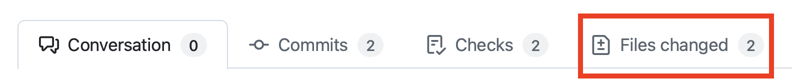
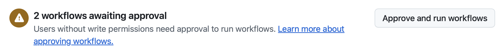
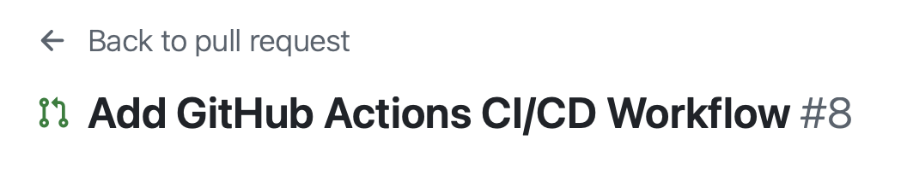
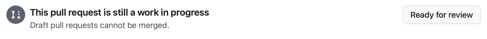

# Exercise 5: Review GitHub Copilot coding agent's work

| [← Adding new functionality with Copilot Agent Mode][previous-lesson] |
|:----:|

When we first started this lab we assigned a couple of issues to GitHub Copilot coding agent. We asked it to add documentation to our code, and generate few endpoints for another team to iterate on. Let's explore the code changes it suggested and, if necessary, provide feedback to Copilot to improve its work.

## Scenario

As has been highlighted numerous times, the fundamentals of software design and DevOps do not change with the addition of generative AI. We always want to review the code generated, and work through our normal DevOps process. With that in mind, let's review the suggestions from GitHub Copilot for creating the documentation and new endpoints before we turn on review for the rest of our team.

## Security and GitHub Copilot coding agent

Because Copilot coding agent performs its tasks asynchronously and without supervision, certain security constraints have been put in place to ensure everything remains safe. These include:

- Copilot only has read access to your repository and write access **only** to the branch it will use for its code.
- Coding agent runs inside of GitHub Actions, where it will create a separate, ephemeral environment in which to work.
- Any GitHub Actions workflows require approval from a human before they can be run.
- [Access to external resources is limited by default][agent-firewall], including MCP servers.

## Reviewing the generated documentation

Let's start by exploring the first pull request (PR) generated by GitHub Copilot coding agent - adding documentation to our code. We'll perform this task by utilizing the standard PR interface in GitHub.com.

> [!NOTE]
> When you explore the PR you may notice a warning about GitHub Copilot being blocked by a firewall. This **is expected**, as Copilot has limited access to external resources by default, including calls to external MCP servers. If you wish, you can [customize or disable the firewall for Copilot coding agent][agent-firewall].

1. Return to your repository on github.com.
2. Select **Pull Requests** to open the list of pull requests.
3. Open issue titled something similar to **Add missing documentation** or something more robust.

> [!NOTE]
> If Copilot is still working on the task, the issue will contain the **[WIP]** flag. If so, wait for Copilot to complete the work. This may take a few minutes, so feel free to take a break, or reflect on everything you've learned so far.

4. Once the pull request is ready, select the **Files changed** tab and review the changes.

    

5. Explore the newly updated code, which includes the newly created docstrings and other documentation. The exact changes will vary.
6. Once you've reviewed the updates and everything looks good, navigate back to the **Conversation** tab and scroll down.
7. You should see an indicator that some workflows are waiting for approval.
8. Click on the **Approve and run workflows** button to allow the workflows to run.

    

9. You should see the workflows get queued in the checks section of the pull request. All being well, you should see that the workflows pass for both the backend and frontend. This may take a few minutes to complete.

## Requesting changes from GitHub Copilot

Working with Copilot on a pull request is not just a one-way street. You can also add comments to the pull request, or inline comments to the code. Copilot will see these comments, and trigger another session to address them. Due to the non-deterministic results, we can't give prescriptive text of what to ask for. Some ideas of what to ask Copilot to update include:

- Add comment headers to the top of each code file with a brief description of what they do.
- Add docstrings to TypeScript and Svelte files.
- Create a README in both the server and client folders with descriptions of the codebase of each.

1. Add a comment requesting a change to the generated documentation. Use one of the ideas above, or another suggestion for Copilot around documentation you'd like to see in the codebase.
2. Feel free to watch the session as Copilot works on the changes.
3. Select **View Session** to watch Copilot perform its work. Notice how Copilot starts a new session to make the updates.
4. You can select **Back to pull request** to return to the pull request.

    

5. Once Copilot has completed the changes, you should see a new commit in the pull request.
6. Select the **Files changed** tab to review the changes.

Feel free to continue iterating until you are happy. Once happy, you can convert the PR to ready from a draft, and merge it into the main branch.



## Review the new endpoints

Let's return to the PR Copilot generated for resolving our issue about adding endpoints to the games API for creating, updating and deleting games.

1. Return to your repository in GitHub.com.
2. Select the **Pull Requests** tab.
3. Select the PR which has a title similar to **Add CRUD endpoints for games API** or something more robust.
4. Select the **Files changed** tab to review the code it generated.
5. Once you've reviewed the updates and everything looks good, navigate back to the **Conversation** tab and scroll down.
6. You should see an indicator that some workflows are waiting for approval.
7. Click on the **Approve and run workflows** button to allow the workflows to run.

    

8. You should see the workflows get queued in the checks section of the pull request. All being well, you should see that the workflows pass for both the backend and frontend. This may take a few minutes to complete.
9. **Optional:** You could even switch to this branch in your Codespace to perform a manual test of the new endpoints. Navigate to your Codespace, open the terminal, and run the following commands (replace **<branch-name>** with the name of the branch Copilot created, e.g. **copilot/fix-8**.):

    ```bash
    git fetch origin
    git checkout <branch-name>
    ```
   
Copilot has created the new endpoints! Just as before, you can work iteratively with Copilot coding agent to request updates. For example, you might want to request Copilot centralizes the error handling to reduce duplication, or ensuring comments and docstrings are added (remember - this was assigned **before** we made the updates to our custom instructions!) Just like before, you can make these requests by adding a new comment on the **Conversation** tab, which Copilot will see and kickoff a new session.

## Optional Exercise - Explore the agent's capabilities with more issues

Having access to a peer programmer who is able to explore our codebase and make changes asynchronously is powerful, allowing us to reach a first iteration across tasks quickly, allowing us to review and guide, or take over and continue coding in the editor.

You have made great progress through the lab, and we're approaching the end. However, we encourage you to create some additional issues in your GitHub repository and use Copilot to solve those. Some ideas include:

- Create a backer interest form on the game details page
- Implement pagination on the game listing endpoint
- Add input validation and error handling to the Flask API
- Something else? What else might you consider?

## Summary

Congratulations! You completed the lab! You worked through several features available to you with GitHub Copilot, from the IDE to the repository. In particular you:

- **Learned how to use GitHub Copilot and the Model Context Protocol (MCP) to streamline software development**. You set up the GitHub MCP server to enable Copilot to interact with your repository, created a detailed backlog using Copilot Agent Mode.
- **Explored how custom instructions and prompt files can guide Copilot to follow your project's coding standards.** You created a custom instructions file to provide context for Copilot, ensuring it generates code that adheres to your project's guidelines and used prompt files to provide guidance for repetitive tasks and established practices.
- **Used Copilot Agent Mode to implement new features, coordinate changes across backend and frontend code, and automate repetitive tasks.** You used GitHub Copilot to implement a new category and publisher filter for the game listing page, making changes across the client, backend, and the resulting tests.
- **Experienced Copilot as a peer programmer, being assigned issues and working collaboratively on pull requests.** You assigned Copilot to issues in your backlog, allowing it to create a pull request, build a plan, implement changes, and iterate further as you provided feedback.

This is just the beginning, and we can't wait to see how you use Copilot to help you with your own projects. We hope you enjoyed the lab, and we look forward to seeing you in the next one! Happy coding!

## Resources

- [GitHub Copilot][github-copilot]
- [About Copilot agents][copilot-agents]
- [Assigning GitHub issues to Copilot][assign-issue]
- [Copilot coding agent setup workflow best practices][coding-agent-best-practices]
- [Configuring Copilot coding agent firewall][agent-firewall]

---

| [← Adding new functionality with Copilot Agent Mode][previous-lesson] |
|:----:|

[github-copilot]: https://github.com/features/copilot
[coding-agent-overview]: https://docs.github.com/en/copilot/using-github-copilot/coding-agent/about-assigning-tasks-to-copilot#overview-of-copilot-coding-agent
[assign-issue]: https://docs.github.com/en/copilot/using-github-copilot/coding-agent/using-copilot-to-work-on-an-issue
[setup-workflow]: https://docs.github.com/en/copilot/using-github-copilot/coding-agent/best-practices-for-using-copilot-to-work-on-tasks#pre-installing-dependencies-in-github-copilots-environment
[copilot-agents]: https://docs.github.com/en/copilot/using-github-copilot/coding-agent/about-assigning-tasks-to-copilot
[coding-agent-best-practices]: https://docs.github.com/en/copilot/using-github-copilot/coding-agent/best-practices-for-using-copilot-to-work-on-tasks
[agent-firewall]: https://docs.github.com/en/copilot/customizing-copilot/customizing-or-disabling-the-firewall-for-copilot-coding-agent

[previous-lesson]: ./4-copilot-agent-mode-vscode.md
